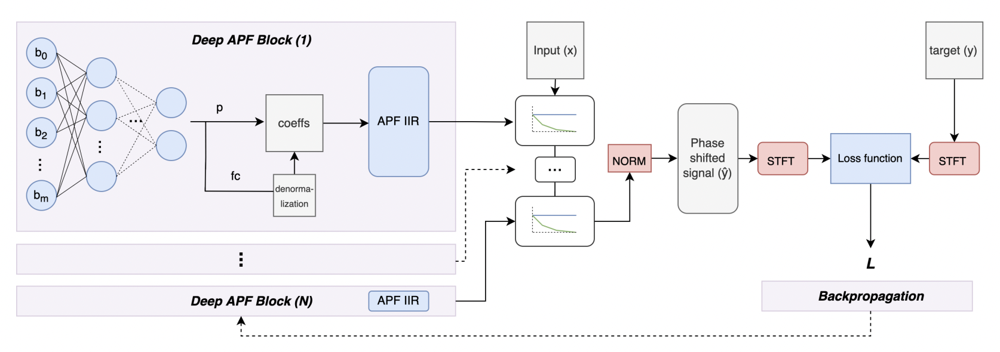

# Differentiable APFs
**Differentiable Allpass Filters for Phase Response Estimation and Automatic Signal Alignment**

This is the official PyTorch repository *exemplifying* the paper of ***Bargum et al.* (Aalborg University), [Diff APF](https://arxiv.org/abs/2306.00860)**.

Audio samples can be heard through the link below!

 

## Abstract

Virtual analog (VA) audio effects are increasingly based on neural networks and deep learning frameworks. Due to the underlying black-box methodology, a successful model will learn to approximate the data it is presented, including potential errors such as latency and audio dropouts as well as non-linear characteristics and frequency-dependent phase shifts produced by the hardware. The latter is of particular interest as the learned phase-response might cause unwanted audible artifacts when the effect is used for creative processing techniques such as dry-wet mixing or parallel compression. To overcome these artifacts we propose differentiable signal processing tools and deep optimization structures for automatically tuning all-pass filters to predict the phase response of different VA simulations, and align processed signals that are out of phase. The approaches are assessed using objective metrics while listening tests evaluate their ability to enhance the quality of parallel path processing techniques. Ultimately, an over-parameterized, BiasNet-based, all-pass model is proposed for the optimization problem under consideration, resulting in models that can estimate all-pass filter coefficients to align a dry signal with its affected, wet, equivalent.

## Proposed Model

The model consists of a BiasNet inspired DNN, outputting filter parameters for the coefficient calculation of different allpass filter structures. Three values, *R*, *f_c* and *a* are denormalized and fed from the output of the network to every single filter block. The primary DNN is an MLP with periodic sinusoidal activations for the hidden layers and tanh activations for the output layer.

## Notes

- Clone the repository and run the notebook to either train your own models or use the pretrained models presented in the paper.
- Use section 1. for personal experimentation and section 2. for inference with the pretrained models.
- Create and train cascades of traditional, warped and warped + strethed allpass filters to obtain the desired filter order.
- Experiment with different loss functions, intialized in the losses.py script

## References and Building Blocks

- *J. Steinmetz and J. D. Reiss*, 2020, [auraloss: Audio focused loss functions in PyTorch](https://github.com/csteinmetz1/auraloss)
- *G. Pepe, L. Gabrielli, S. Squartini, C. Tripodi, and N. Strozzi*, 2022, [Deep optimization of parametric IIR filters
for audio equalization](https://arxiv.org/abs/2110.02077)
- *Kuznetsov, J. D. Parker, and F. Esqueda*, 2020, [Differentiable IIR filters for machine learning applications](https://dafx2020.mdw.ac.at/proceedings/papers/DAFx2020_paper_52.pdf)

